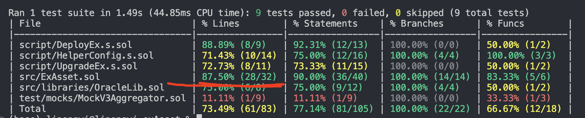
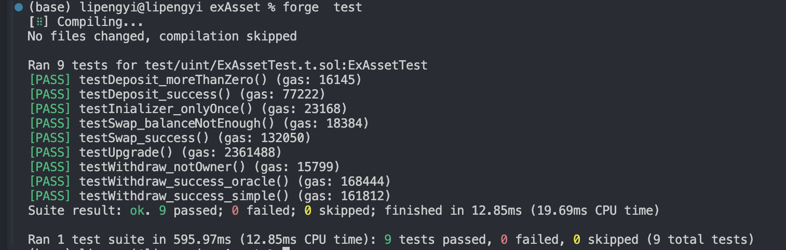
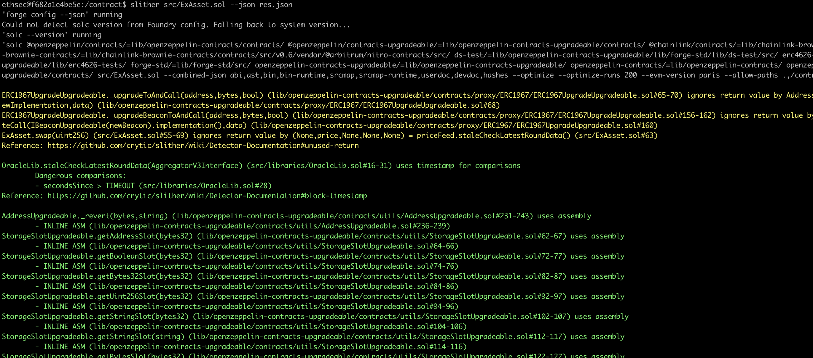

[TOC]
### FEATURES
- 业务功能
  - 支持用户存入ETH
  - 支持用户兑换usdc并取出
  - owner可以取出合约中剩余的ETH,USDC
- 特性
  - 复用openzeppelin代码
  - 接入chainlink预言机
  - 实现UUPS可升级合约

### TEST
- 单元测试
  - initialize 测试
  - deposit/swap/withdraw
- 预言机价格测试
  - 测试环境使用mock文件进行测试
- 升级测试
  - 升级前后，storage数据不受影响

### slither 检测

### 部署指南
- 维护自己的.env环境变量
- make install  (相关依赖版本已经配置好)
- make test
- make deploy
- make upgrade

### SEPOLIA 已部署合约
logic contract-1: 0x044da787a884227b4b76084c9884808045af5f1e
logic contract-2: 0x330576e950e9a246f524024112783b226628b63b
proxy contract: 0x7774bbf74dae45bc89796ad2906277e7bd8e6c6d
(因为组件相关的一些原因，verify未成功，还未解决。)